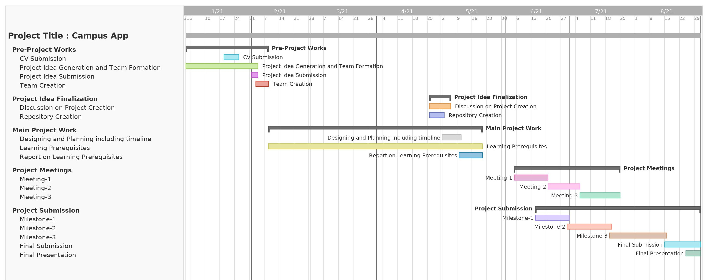

# G57-Campus-App
A platform for the people of SUST.

Expected Timeline
=================

Features with Description
-------------------------
- [ ] Notices - depratmental and organizational notices will be published here.
- [ ] Events - events that are open for everyone will be published here.
- [ ] Stories -  blogging section.
- [ ] News - news section.
- [ ] Marketplace - buy/sell/share any kind of goods.
- [ ] Report  -  report a problem regarding campus. users can also report of harassment/abuse.

Project Meetings and Submissions
--------------------------------
- [ ] Meeting-1
- [ ] Meeting-2
- [ ] Meeting-3
- [ ] Submission-1
- [ ] Submission-2
- [ ] Submission-3

Report on Learning Pre-requisities
-----------------------------------

SL | Learning Task | Description | Status | Comment |
--:|:--------------|:------------|:------:|---------|
1  | Android Basics   | Basics of UI elements and other Front-End stuffs |    | |
2  | Advanced Android Componenets   | Back-End stuffs  |    | |
3  | Firebase  | Database Connectivity and user authentication stuffs  |    | |
4  | External Libraries   | We might need to use external libraries for blogging and other purposes |    | |
